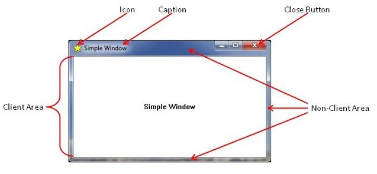
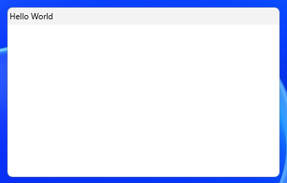
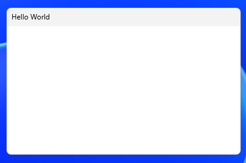
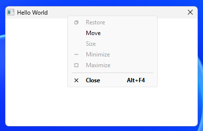
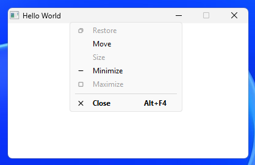
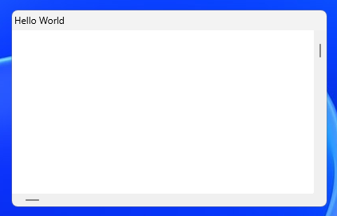
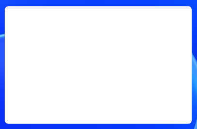
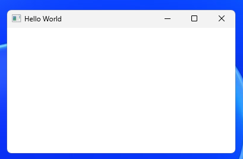
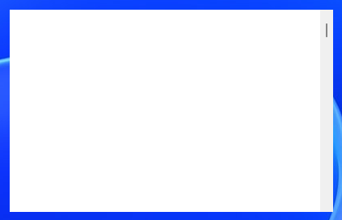

# Window

A window is a fundamental unit of the Windows GUI. It represents a rectangular region on the screen.

Windows are not just top level application windows with a titlebar and borders, but can be any type of UI
control (e.g. buttons, lists...etc).

The type of a window is `HWND` which is an opaque handle to the window which is managed by Windows OS.
It is not meant to be modified directly, but rather passed to various win32 functions. (e.g. `MoveWindow(hwnd, 100, 100, 800, 600, TRUE);`)

Each window is created from a window class that defines default / shared behavior for all windows created from it.
The window classes in question are not C++ classes, but rather configuration templates for windows specific to win32.

There are predefined built-in classes ([standard](#standard-controls) and [common](#common-controls) controls),
but you can create custom ones using [RegisterClass](#registerclass).

For the main application window, you'd typically register your own custom class.

There are 3 general categories of windows in terms of [ownership](#ownership): top level, top level with parent, and child window.

Event handling is done via a [message loop](#message-loop) and the [window procedure](#window-procedure) callback.



## RegisterClass

Before creating a custom window, a custom window class must be registered.

Registering a class is required to create a custom window, but also used for setting certain default behavior for windows created from the class.

To do that, we call a `RegisterClass` function and pass it a pointer to a `WNDCLASS` struct.

`RegisterClass` functions:

- RegisterClassA
- RegisterClassW
- RegisterClassExA
- RegisterClassExW - modern, preferred

`WNDCLASS` structs:

- WNDCLASSA
- WNDCLASSW
- WNDCLASSEXA
- WNDCLASSEXW - modern, preferred

`WNDCLASS` members:

- [style](#styles) - bitmask for setting additional window behavior(s).
- [lpfnWndProc](#window-procedure) - pointer to the window event handler callback.
- hInstance - handle to the executable module, usually the hInstance argument you get in WinMain (wWinMain)
- [hIcon](#icons) - handle to an icon resource used as the window icon.
- [hCursor](#cursors) - handle to a cursor resource use as the window cursor icon.
- hbrBackground - handle to a brush used to paint the window client area background using GDI.
- lpszMenuName - string that specifies the resource name of a menu as it appears in your .rc file.
- lpszClassName - string that identifies this class. Could also be an ATOM returned by a previous call to RegisterClass.
- cbClsExtra - number of extra bytes to allocate for per-class custom app data. Rarely used today.
- cbWndExtra - number of extra bytes to allocate for per-window custom app data.

`WNDCLASSEX` only members:

- cbSize - the size of the structure in bytes. Usually `sizeof(WNDCLASSEX)`.
- [hIconSm](#icons) - a handle to an icon resource used as the small window icon.

Example:

```cpp
LRESULT CALLBACK windowProc(HWND hwnd, UINT uMsg, WPARAM wParam, LPARAM lParam); // implemented elsewhere

// the main entry function
int WINAPI wWinMain(HINSTANCE hInstance, HINSTANCE hPrevInstance, PWSTR pCmdLine, int nCmdShow) {
  WNDCLASSEX wc = {0};
  wc.cbSize = sizeof(WNDCLASSEX);
  wc.lpfnWndProc = windowProc; // callback defined elsewhere
  wc.hInstance = hInstance;
  wc.lpszClassName = L"MyWindowClass";

  ATOM classAtom = RegisterClassEx(&wc);

  if (classAtom == 0) {
    return EXIT_FAILURE;
  }

  // Proceed with creating windows...etc.
}

```

## CreateWindow

// TODO

## Standard controls

// TODO

## Common controls

// TODO

## Ownership

// TODO

## Styles

There are three base window styles that you can use as a starting point:

- `WS_OVERLAPPED` - top level windows
- `WS_POPUP` - special top level windows like dialogs, menus, splash screens...etc.
- `WS_CHILD` - child windows that are visually constrained / clipped in a parent window.

### WS_OVERLAPPED

`WS_OVERLAPPED` flag gives you the small titlebar with the caption and
the client area painted white by default. There are no resizable borders.



`WS_OVERLAPPED | WS_THICKFRAME` gives overlapped style + a resizable border and a taller titlebar.



`WS_OVERLAPPED | WS_SYSMENU` gives overlapped style + icon and the close button. No resizable border.
Right clicking on the titlebar opens the system menu. Minimize and maximize are available as options in the system menu, but are disabled and there are now titlebar buttons for them. You can add them with `WS_MINIMIZEBOX` and `WS_MAXIMIZEBOX` flags.



`WS_MINIMIZEBOX` and `WS_MAXIMIZEBOX` require the `WS_SYSMENU` flag.

`WS_OVERLAPPED | WS_SYSMENU | WS_MINIMIZEBOX` gives overlapped style + system menu with the minimize option now available
and the minimize button. Maximize button is shown, but disabled.



`WS_OVERLAPPEDWINDOW` is a flag that encompasses everything from before (titlebar, resizable borders, system menu...etc).

It is defined as `WS_OVERLAPPED | WS_CAPTION | WS_SYSMENU | WS_THICKFRAME | WS_MINIMIZEBOX | WS_MAXIMIZEBOX`


`WS_HSCROLL` and `WS_VSCROLL` can be used to add scrollbars.

`WS_OVERLAPPED | WS_HSCROLL | WS_VSCROLL`



### WS_POPUP

`WS_POPUP` gives the frameless style - no title bar, no border whatsoever (no rounding).

Could be used if you want control over the entire surface of the window.

The client area will not be painted by default, but the easiest way to do it is to set `hbrBackground` on `WNDCLASS`:

```cpp
wc.hbrBackground = (HBRUSH)(COLOR_WINDOW + 1); // default, white background
```

You could also handle the `WM_ERASEBKGND` or `WM_PAINT` message to paint the background yourself and/or have your own render loop.


You can add other styles to `WS_POPUP` like the styles we used with `WS_OVERLAPPED`.

`WS_POPUP | WS_THICKFRAME` gives a frameless window with rounded corners and a resizable border.



`WS_POPUP | WS_CAPTION | WS_THICKFRAME | WS_SYSMENU | WS_MINIMIZEBOX | WS_MAXIMIZEBOX` gives visually the same window as with `WS_OVERLAPPEDWINDOW`.



Scrollbar flags work with `WS_POPUP` as well.

`WS_POPUP | WS_VSCROLL`:



### Behavior styles

`WS_VISIBLE` The window is visible initially.
You can call `ShowWindow` or `SetWindowPos` to show/hide the window.

`WS_DISABLED` The window is disabled initially. Visually, the frame looks the same, but all input to the window is blocked.
You can change this by calling `EnableWindow`.

`WS_MINIMIZE` The window is minimized initially. `WS_ICONIC` is an alias for `WS_MINIMIZE`.

`WS_MAXIMIZE` The window is maximized initially.

`WS_GROUP` Used for grouping of child windows for keyboard navigation, focus and radio button grouping.

### Other styles

`WS_BORDER` The window has a thin line border.

`WS_DLGFRAME` The window has a dialog-box like border. A window with this style cannot have a title bar.

## Message loop

// TODO

## Window procedure

// TODO

## Icons

// TODO

## Cursors

// TODO

## Custom data

// TODO
