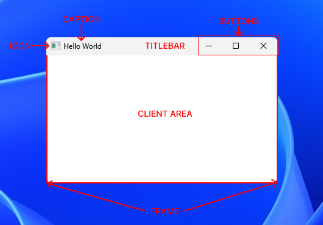
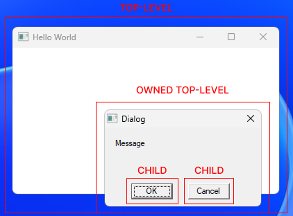
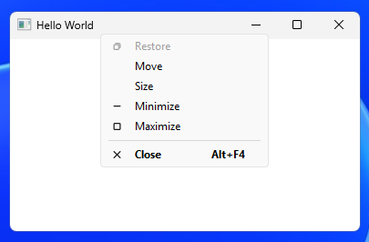
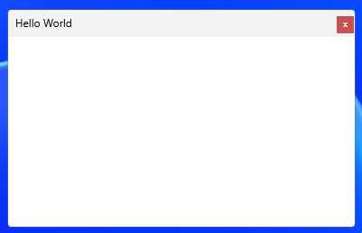
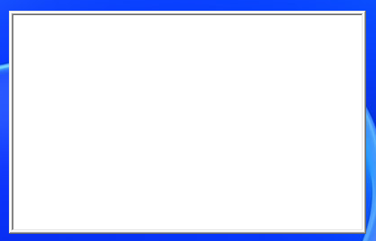

# Window

A window is a fundamental unit of the Windows GUI. It represents a rectangular region on the screen.

Windows are not just top-level application windows with a titlebar and borders, but can be any type of UI
control (e.g. buttons, lists...etc).

The type of a window is [`HWND`](./types.md#hwnd) which is an opaque handle to the window which is managed by win32.
It is not meant to be modified directly, but rather passed to various win32 functions like:

```cpp
MoveWindow(hwnd, 100, 100, 800, 600, TRUE);
```

Each window is created from a window class that defines default / shared behavior for all windows created from it.
The window classes in question are not C++ classes, but rather configuration templates for windows specific to win32.

There are predefined built-in classes in the [control library](./controls.md),
but you can create custom ones using [RegisterClass](#registerclass).

For the main application window, you'd typically register your own custom class.

There are 3 general categories of windows in terms of [ownership](#ownership): top-level, owned top-level, and child window.

Event handling is done via a [message loop](#message-loop) and the [window procedure](#window-procedure) callback.

The main parts of a window are:

- titlebar with icon, caption, window buttons and system menu
- frame or border that can be used for resizing
- client area for rendering the window's content

Titlebar and frame are called non-client area.

|  |
| :----------------------------------------: |
|                Window parts                |

## Ownership

There are 3 types of windows in terms of ownership:

- Top-level
- Owned top-level
- Child

Top-level windows are independent windows positioned in screen coordinates such as a main application window.

Owned top-level windows are still positioned in screen coordinates and can visually leave their parent's bounds, but are dependent on their parent window in certain ways. They are always in front of their parent. They are minimized and restored with the parent except in some special cases (e.g. modal dialogs).
They are destroyed when the parent is destroyed.

|  |
| :------------------------------------------------: |
|                  Window ownership                  |

## RegisterClass

Registers a custom window class and defines default behavior for use in subsequent [CreateWindow](#createwindow) calls.

This function has [extended](./extended.md) and [unicode](./unicode_ansi.md) variants.

Accepts a [WNDCLASS](#wndclass) struct pointer and returns the class [ATOM](./types.md#atom) on success or 0 on failure. [GetLastError](./errors.md#getlasterror) can be called in case of failure.

Example:

```cpp
LRESULT CALLBACK windowProc(HWND hwnd, UINT uMsg, WPARAM wParam, LPARAM lParam); // implemented elsewhere

// the main entry function
int WINAPI wWinMain(HINSTANCE hInstance, HINSTANCE hPrevInstance, PWSTR pCmdLine, int nCmdShow) {
  WNDCLASSEX wc = {0};
  wc.cbSize = sizeof(WNDCLASSEX);
  ws.style = CS_HREDRAW | CS_VREDRAW;
  wc.lpfnWndProc = windowProc; // callback declared above
  wc.hInstance = hInstance;
  wc.lpszClassName = L"MyWindowClass"; // L to treat it as WCHAR (Unicode)

  ATOM classAtom = RegisterClassEx(&wc);

  if (classAtom == 0) {
    return EXIT_FAILURE;
  }

  // Proceed with creating window...etc.
}

```

## WNDCLASS

This struct is used with [RegisterClass](#registerclass).

This struct has [extended](./extended.md) and [unicode](./unicode_ansi.md) variants.

### Members:

- `style` - bitmask for setting [class styles](#class-styles).
- `lpfnWndProc` - pointer to the [window procedure](#window-procedure) callback.
- `hInstance` - handle to the executable module, like the hInstance parameter of `WinMain` or acquired with `GetModuleHandle`.
- `lpszClassName` - string that identifies this class. The class name is scoped to the module i.e two different modules can register a class with the same name.
- `cbSize` - the size of the structure in bytes. Set it to `sizeof(WNDCLASSEX)`. Used so that win32 knows
  which version of `WNDCLASS` you're using. Extended only.
- `hIcon` - [handle](./types.md#hicon) to an icon resource used as the [window icon](#icons).
- `hIconSm` - a [handle](./types.md#hicon) to an icon resource used as the small [window icon](#icons). Extended only.
- `hCursor` - [handle](./types.md#hcursor) to a cursor resource used as the [window cursor](#cursor) icon by default.
- `hbrBackground` - [handle](./types.md#hbrush) to a brush used to paint the window client area background using [GDI](./gdi.md).
- `lpszMenuName` - string that specifies the resource name of a menu as it appears in your .rc file.
- `cbClsExtra` - number of extra bytes to allocate for per-class [custom app data](#custom-data). Rarely used today.
- `cbWndExtra` - number of extra bytes to allocate for per-window [custom app data](#custom-data).

## Class styles

These styles are set on [WNDCLASS](#wndclass).

`CS_DBLCLKS` - Enables the windows to receive double click messages (e.g `WM_LBUTTONDBLCLK`).

`CS_NOCLOSE` - Disables the close button on the window.

`CS_DROPSHADOW` - Adds a drop-shadow effect on top-level windows (e.g. menus). Cannot be used with child windows.

`CS_HREDRAW` - Invalidates client area when width changes. Used with [GDI](./gdi.md).

`CS_VREDRAW` - Invalidates client area when height changes. Used with [GDI](./gdi.md).

`CS_CLASSDC` - All windows within class share the same DC. Mainly used with [GDI](./gdi.md).

`CS_OWNDC` - Each window within class gets its own DC. Mainly used with [GDI](./gdi.md) and OpenGL.

`CS_PARENTDC` - Child windows use the parent's DC as an optimization. Mainly used with [GDI](./gdi.md).

`CS_GLOBALCLASS` - Makes the class globally available to all other modules in the process. Rarely used today.

`CS_SAVEBITS` - Saves a bitmap of the part of screen obscured by this window so when this window is removed,
the pixels that were underneath are restored from the bitmap instead doing a full repaint.
Legacy feature, made obsolete by [DWM](./dwm.md).

`CS_BYTEALIGNWINDOW` - Forces the window rectangle to start on a byte boundary in memory. Legacy feature.

`CS_BYTEALIGNCLIENT` - Forces the client area rectangle to start on a byte boundary in memory. Legacy feature.

## CreateWindow

This function has [extended](./extended.md) and [unicode](./unicode_ansi.md) variants.

**Parameters**

- `dwExStyle` - bitmask for setting [extended window styles](#extended-window-styles).
- `lpClassName` - string that identifies a registered class or an [ATOM](./types.md#atom) returned by a previous call to [RegisterClass](#registerclass) wrapped with `MAKEINTATOM`.
- `lpWindowName` - string that appears as the caption for windows with titlebars, button text for [standard Button control](./controls.md#button)...etc.
- `dwStyle` - bitmask for setting [window styles](#window-styles).
- `X` - horizontal upper-left corner position of the window. For top-level windows, it's relative to the screen,
  and for child windows it's relative to the upper-left corner of the parent's client area.
- `Y` - vertical upper-left corner position of the window. For top-level windows, it's relative to the screen,
  and for child windows it's relative to the upper-left corner of the parent's client area.
- `nWidth` - width of the window in device units.
- `nHeight` - height of the window in device units.
- `hWndParent` - handle to the parent or owner window. Required for child windows, optional for top-level windows.
- `hMenu` - for top-level windows this should be a handle to a menu or null, for child windows the identifier used to distinguish child controls.
- `hInstance` - handle to executable module. Might not always be required here, but it's safer and there's no harm in passing it - even for [standard controls](./controls.md).
- `lpParam` - arbitrary pointer that will be available as `CREATESTRUCT.lpCreateParams` in `WM_CREATE` `lParam`.
  You can use it to pass custom data to [window procedure](#window-procedure). Required for MDI.

**Return value**

The new window's [handle](./types.md#hwnd) or `NULL` if it fails. [GetLastError](./errors.md#getlasterror) can be called in case of failure.

Example creating a top-level window:

```cpp
const wchar_t className[] = L"MyWindowClass";

// WNDCLASS struct creation

ATOM classAtom = RegisterClass(&wc);

HWND myWindow = CreateWindowEx(
  WS_EX_ACCEPTFILES, // dwExStyle
  className, // or MAKEINTATOM(classAtom)
  L"Hello World", // lpWindowName
  WS_OVERLAPPEDWINDOW | WS_VISIBLE,
  100, // x
  100, // y
  1024, // width
  768, // height
  nullptr, // parent
  nullptr, // menu
  hInstance, // maybe we could pass null since we already registered the class with it (?)
  nullptr, // lParam
)

if (!myWindow) {
  return EXIT_FAILURE;
}

// Proceed with the message loop, rendering...etc.
```

Example creating a child window ([standard Button control](./controls.md#button)):

```cpp
// we don't need to register the class for a standard control

HWND myButton = CreateWindowEx(
  0, // no extended styles
  L"BUTTON", // predefined standard class
  L"Click Me", // button text
  WS_CHILD | WS_VISIBLE | WS_TABSTOP | BS_PUSHBUTTON, // child window, visible initially, tabbable, push button (classic button)
  10, // x
  10, // y
  100, // width
  30, // height
  myWindow, // parent window
  (HMENU)1, // control ID
  hInstance, // probably could pass null for a standard control (?)
  nullptr, // lpParam not used for standard controls
);
```

## Window styles

These styles are used when [creating a window](#createwindow).

### Visual styles

There are three base window styles that you can use as a starting point:

- `WS_OVERLAPPED` - top-level windows
- `WS_POPUP` - special top-level windows like dialogs, menus, splash screens...etc.
- `WS_CHILD` - child windows that are visually constrained / clipped in a parent window.

`WS_OVERLAPPED` produces a basic window with a frame and a minimal titlebar. No resizable border or window buttons.

`WS_POPUP` produces a frameless window with just the client area and no borders at all (no rounding).
Client area needs to be painted for the window to be visible. Easiest way to do it:

```cpp
wc.hbrBackground = (HBRUSH)(COLOR_WINDOW + 1); // default, white background
```

`WS_THICKFRAME` adds a resizable border and makes the titlebar taller (if present). Also adds a rounded border when used with `WS_POPUP`. Alias is `WS_SIZEBOX`.

`WS_SYSMENU` adds the window icon, system menu and window buttons. `WS_MINIMIZEBOX` and `WS_MAXIMIZEBOX` are used
alongside it to add the minimize and maximize buttons.

`WS_OVERLAPPEDWINDOW` is the full, standard overlapped window.
Defined as `WS_OVERLAPPED | WS_CAPTION | WS_SYSMENU | WS_THICKFRAME | WS_MINIMIZEBOX | WS_MAXIMIZEBOX`.

`WS_HSCROLL` and `WS_VSCROLL` are used to add horizontal and vertical scrollbars.

`WS_BORDER` The window has a thin line border.

`WS_DLGFRAME` The window has a dialog-box like border. A window with this style cannot have a title bar.

|  |  |
| :------------------------------------------------------------------------: | :--------------------------------------------------: |
|               WS_OVERLAPPEDWINDOW with the system menu open                |                 WS_POPUP only window                 |

### Behavior styles

`WS_VISIBLE` The window is visible initially. Can be modified with [`ShowWindow`](#showwindow) or [`SetWindowPos`](#setwindowpos).

`WS_DISABLED` The window is disabled initially. Visually, the frame looks the same, but all input to the window is blocked.
Can be modified with `EnableWindow`.

`WS_MINIMIZE` The window is minimized initially. Alias is `WS_ICONIC`.

`WS_MAXIMIZE` The window is maximized initially.

`WS_CLIPCHILDREN` Child windows are excluded from the window's painting operations. Prevents parent from
overwriting child windows and flicker. Mainly used with [GDI](./gdi.md).

`WS_CLIPSIBLINGS` Applied to a child window so that it doesn't overwrite the area of the sibling windows it overlaps with,
but only paint its own visible area. Mainly used with [GDI](./gdi.md).

`WS_GROUP` Makes the child window the beginning of a group of controls. Used for keyboard navigation, focus, and radio button groups. Used with standard controls.

`WS_TABSTOP` Makes a child window focusable via pressing Tab. Used with [standard controls](./controls.md).

## Extended window styles

These styles are used when [creating a window](#createwindow).

### Taskbar / titlebar / visual styles

`WS_EX_APPWINDOW` Adds a taskbar icon for owned top-level windows (e.g. dialogs) which would normally be grouped under
their parent window.

`WS_EX_TOOLWINDOW` A tool window doesn't have a taskbar icon, has a smaller titlebar with only a close button and no app icon.

`WS_EX_OVERLAPPEDWINDOW` Defined as `WS_EX_WINDOWEDGE | WS_EX_CLIENTEDGE`.

`WS_EX_PALETTEWINDOW` Defined as `WS_EX_WINDOWEDGE | WS_EX_TOOLWINDOW | WS_EX_TOPMOST`.

|  |
| :------------------------------------------------------------------------------------: |
|                        WS_OVERLAPPEDWINDOW and WS_EX_TOOLWINDOW                        |

### Graphics / transparency

`WS_EX_NOREDIRECTIONBITMAP` Tells [DWM](./dwm.md) to not create a [GDI](./gdi.md) backing surface for the window meaning the client area will not be rendered by default. To present the client area, you need to use the DirectComposition API or similar.

`WS_EX_LAYERED` Improves performance, reduces flickering and enables per-pixel alpha blending and transparency effects for the window.
Can be used to create non-rectangular shaped windows (e.g. Winamp skins). Cannot be used with `CS_CLASSDC` or `CS_OWNDC` [class styles](#class-styles).
More on [layered windows](#layered-window).

`WS_EX_COMPOSITED` The window uses double buffering to paint to reduce flicker. Legacy, made obsolete by [DWM](./dwm.md).

`WS_EX_TRANSPARENT` The child window is not painted until siblings underneath it have been painted. This allows for the top window to be blended with
windows underneath. This only affects the paint order (which is top-down by default), not the actual transparent rendering.

|  |
| :----------------------------------------------------------------------------------------------------------------------: |
|                                    WS_OVERLAPPEDWINDOW and WS_EX_NOREDIRECTIONBITMAP                                     |

### Z-order / activation

`WS_EX_TOPMOST` The window is placed above all non-topmost windows, even when it's deactivated. Can be modified with [`SetWindowPos`](#setwindowpos).

`WS_EX_NOACTIVATE` The window is not activated (brought to the foreground) when clicked on. It doesn't appear on the taskbar by default, but adding `WS_EX_APPWINDOW` forces it. Can be modified with [`SetActiveWindow`](#setactivewindow) and [`SetForegroundWindow`](#setforegroundwindow).

### Frame / border

`WS_EX_WINDOWEDGE` The window has a border with a raised edge. Doesn't seem to have an effect on post-XP Windows.

`WS_EX_CLIENTEDGE` The window has a border with a sunken edge. Has an effect when used with `WS_POPUP` and more pronounced when `WS_DLGFRAME` is added.

`WS_EX_STATICEDGE` The window has a three-dimensional border style. Doesn't seem to have an effect on post-XP Windows.

`WS_EX_DLGMODALFRAME` The window has a double border and can have a titlebar. Doesn't seem to have an effect on post-XP Windows.

|  |
| :----------------------------------------------------------------------------------------------: |
|                           WS_POPUP \| WS_DLGFRAME and WS_EX_CLIENTEDGE                           |

### Reading order (LTR/RTL) / layout

`WS_EX_LEFTSCROLLBAR` The vertical scrollbar (if present) is to the left of the client area.

`WS_EX_RIGHTSCROLLBAR` The vertical scrollbar (if present) is to the right of the client area. This is the default for `WS_VSCROLL`.

`WS_EX_LAYOUTRTL` Flips the horizontal origin of the window client area. Increasing horizontal values advance to the left.

`WS_EX_LTRREADING` Text is drawn left-to-right. This is the default.

`WS_EX_RTLREADING` Text is drawn right-to-left.

`WS_EX_NOINHERITLAYOUT` The layout is not inherited from parent to child windows.

`WS_EX_LEFT` The window has generic left-aligned properties (?). This is the default.

`WS_EX_RIGHT` The window has generic right-aligned properties (?).

### Other

`WS_EX_ACCEPTFILES` Allows the window to accept files by drag and drop using the [shell api](./shell.md#shell) and `WM_DROPFILES`.
Can be modified with [`DragAcceptFiles`](./shell.md#dragacceptfiles). Mostly legacy and replaced with OLE.

`WS_EX_CONTROLPARENT` The children of this window become included in focus navigation via Tab and Arrow keys instead
of treating the whole window as one focusable item.

`WS_EX_NOPARENTNOTIFY` The parent window is not notified with `WM_PARENTNOTIFY` notifications when child windows are created / destroyed.

`WS_EX_MDICHILD` The window is an MDI child.

`WS_EX_CONTEXTHELP` The window titlebar shows a help icon which when clicked, changes the cursor to a help cursor that can be used
to click around the window to open help popups via `WM_HELP` and `WinHelp`. Doesn't seem to have an effect post Windows 95.

## Message loop

// TODO

## Window procedure

Window procedure is a callback function of type `WNDPROC` that processes messages sent to a window.

It is defined for a window class on [WNDCLASS](#wndclass) when [registering a class](#registerclass).

**Parameters**

- hwnd [window handle](./types.md#hwnd)
- uMsg the message code
- wParam additional message information. The contents depend on the message code.
- lParam additional message information. The contents depend on the message code.

**wParam vs lParam**

`wParam` is typed as [WPARAM](./types.md#wparam) which is a [UINT_PTR](./types.md#uint_ptr) (unsigned) and `lParam` is typed as [LPARAM](./types.md#lparam) which is a [LONG_PTR](./types.md#long_ptr) (signed).

`wParam` is typically used for small values, flags, or identifiers (like control IDs, key codes, or notification codes), while `lParam` is typically used for larger values or pointers (like passing a struct pointer, coordinates, or handles).

`wParam` means "Word parameter" because on 16‑bit Windows it was typed as a 16-bit [WORD](./types.md#word). `lParam` means "Long parameter" because on 16-bit Windows it was typed as a 32-bit [LONG](./types.md#long).

**Return value**

It should return an [LRESULT](./types.md#lresult) code that depends on the message that was handled.

Minimal example:

```c
LRESULT CALLBACK windowProc(HWND hwnd, UINT uMsg, WPARAM wParam, LPARAM lParam) {
  switch(uMsg) {
    case WM_CREATE:
    {
      BOOL initSuccess = initialize(); // initialize is some example function

      if(!initSuccess) {
        return -1; // destroy window
      }
      else {
        return 0; // proceed with creation
      }
    }
    case WM_DESTROY:
    {
      PostQuitMessage(EXIT_SUCCESS);
      return 0; // we handled it
    }
  }

  return DefWindowProc(hwnd, uMsg, wParam, lParam); // default handler for messages we don't handle
}
```

## Icons

// TODO

## Cursor

// TODO

## Layered window

// TODO

## Custom data

// TODO

## SetWindowPos

Changes the position, size, and Z order of a window.

**Parameters**

- hwnd [window handle](./types.md#hwnd)
- hWndInsertAfter [window handle](./types.md#hwnd) of the window that should be beneath or one of the [codes](#z-order-codes).
- X The new position of the left side of the window, in client coordinates.
- Y The new position of the top of the window, in client coordinates.
- cx The new width of the window, in pixels.
- cy The new height of the window, in pixels.
- uFlags The window sizing and positioning [flags](#flags).

**Return value**

[BOOL](./types.md#bool) that's `TRUE` if the function succeeds. [GetLastError](./errors.md#getlasterror) can be called in case of failure.

```c
BOOL didSucceed = SetWindowPos(hwnd, HWND_TOP, 10, 10, 500, 500, SWP_SHOWWINDOW | SWP_NOREDRAW);
```

### Z order codes

`HWND_BOTTOM` Bottom of the z order.

`HWND_NOTOPMOST` Above all non-topmost windows.

`HWND_TOP` Top of the window's z order "layer" - if window is topmost, goes to the top of the z order, otherwise goes to the top of non-topmost windows.

`HWND_TOPMOST` Top of the z order.

### Flags

`SWP_ASYNCWINDOWPOS` If the calling thread and the thread that owns the window are attached to different input queues, the system posts the request to the thread that owns the window. This prevents the calling thread from blocking its execution while other threads process the request.

`SWP_DEFERERASE` Prevents generation of the `WM_SYNCPAINT` message.

`SWP_DRAWFRAME` Draws a frame (defined in the window's class description) around the window.

`SWP_FRAMECHANGED` Applies new frame styles set using the `SetWindowLong` function. Sends a `WM_NCCALCSIZE` message to the window, even if the window's size is not being changed. If this flag is not specified, `WM_NCCALCSIZE` is sent only when the window's size is being changed.

`SWP_HIDEWINDOW` Hides the window.

`SWP_NOACTIVATE` Does not activate the window. If this flag is not set, the window is activated and moved to the top of either the topmost or non-topmost group (depending on the setting of the hWndInsertAfter parameter).

`SWP_NOCOPYBITS` Discards the entire contents of the client area. If this flag is not specified, the valid contents of the client area are saved and copied back into the client area after the window is sized or repositioned.

`SWP_NOMOVE` Retains the current position (ignores X and Y parameters).

`SWP_NOOWNERZORDER` Does not change the owner window's position in the Z order. Alias is `SWP_NOREPOSITION`.

`SWP_NOREDRAW` Does not redraw changes. If this flag is set, no repainting of any kind occurs. This applies to the client area, the nonclient area (including the title bar and scroll bars), and any part of the parent window uncovered as a result of the window being moved. When this flag is set, the application must explicitly invalidate or redraw any parts of the window and parent window that need redrawing.

`SWP_NOSENDCHANGING` Prevents the window from receiving the `WM_WINDOWPOSCHANGING` message.

`SWP_NOSIZE` Retains the current size (ignores the cx and cy parameters).

`SWP_NOZORDER` Retains the current Z order (ignores the hWndInsertAfter parameter).

`SWP_SHOWWINDOW` Displays the window.

## ShowWindow

Sets the specified window's show state.

Accepts a [window handle](./types.md#hwnd) and a [code](#showwindow-codes) and returns [BOOL](./types.md#bool) that's `TRUE` if the window was visible before.

The first time the application calls this, second argument is ignored if `STARTUPINFO` was provided,
otherwise the first time this is called the second argument should be the `nCmdShow` parameter of `WinMain`.

In subsequent calls, any [code](#showwindow-codes) can be provided.

```c
BOOL wasVisible = ShowWindow(hwnd, SW_HIDE); // hides the window
```

## ShowWindow codes

These codes are used with [ShowWindow](#showwindow).

`SW_HIDE` Hides the window and activates another window.

`SW_SHOWNORMAL` and `SW_NORMAL` Activates and displays a window. If the window is minimized, maximized, or arranged, the system restores it to its original size and position. An application should specify this flag when displaying the window for the first time.

`SW_SHOWMINIMIZED` Activates the window and displays it as a minimized window.

`SW_SHOWMAXIMIZED` and `SW_MAXIMIZE` Activates the window and displays it as a maximized window.

`SW_SHOWNOACTIVATE` Displays a window in its most recent size and position. This value is similar to `SW_SHOWNORMAL`, except that the window is not activated.

`SW_SHOW` Activates the window and displays it in its current size and position.

`SW_MINIMIZE` Minimizes the specified window and activates the next top-level window in the Z order.

`SW_SHOWMINNOACTIVE` Displays the window as a minimized window. This value is similar to `SW_SHOWMINIMIZED`, except the window is not activated.

`SW_SHOWNA` Displays the window in its current size and position. This value is similar to `SW_SHOW`, except that the window is not activated.

`SW_RESTORE` Activates and displays the window. If the window is minimized, maximized, or arranged, the system restores it to its original size and position. An application should specify this flag when restoring a minimized window.

`SW_SHOWDEFAULT` Sets the show state based on the SW\_ value specified in the `STARTUPINFO` structure passed to the `CreateProcess` function by the program that started the application.

`SW_FORCEMINIMIZE` Minimizes a window, even if the thread that owns the window is not responding. This flag should only be used when minimizing windows from a different thread.

## SetActiveWindow

Activates a window. The window must be attached to the calling thread's message queue.

Accepts a [window handle](./types.md#hwnd) and returns the previously active [window handle](./types.md#hwnd) or `NULL` in case of failure. [GetLastError](./errors.md#getlasterror) can be called in case of failure.

Only works if application is already in the foreground.

```c
HWND prevActiveWindowOrNull = SetActiveWindow(hwnd);
```

## SetForegroundWindow

Accepts a [window handle](./types.md#hwnd) and brings the window to foreground and activates it.

```c
BOOL windowWasBroughtToForeground = SetForegroundWindow(hwnd);
```
